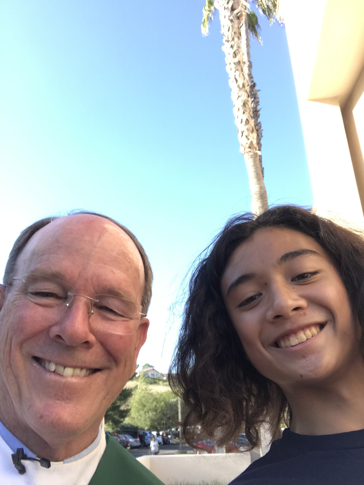

## All About Me and This Course:

Hello, my name is Ian Manangan, and I'm excited to be a part of Computer Science & Software Engineering! I’m currently a Sophomore at Del Norte High School and during my free time, I typically like to play volleyball. Finishing 8th grade, I played for a local program called Seaside, and continued to play there to this day, along with the Del Norte Volleyball “B Team” in Freshman year. I usually play as an outside, or someone who plays on the outside positions, but I’ve played other positions as well such as the Setter, Opposite, and Libero 

 

The main reason for taking CSSE was because I wanted to get some experience with JavaScript and Python so I can use that for unity or my animations in the future. Similar to Matthew, I've taken Computer Animation 1 and 2 during my Freshman year and initially was gonna make Animation as my primary goal. However, I needed some experience with coding as a suggestion from my Sister who’s a Computer Science major.

 

## Test

Blogging in GitHub pages is a way to learn and code at the same time. 

- Plans, Lists, [Scrum Boards](https://clickup.com/blog/scrum-board/) help you to track key events, show progress and record time.  Effort is a big part of your class grade.  Show plans and time spent!
- [Hacks(Todo)](https://levelup.gitconnected.com/six-ultimate-daily-hacks-for-every-programmer-60f5f10feae) enable you to stay in focus with key requirements of the class.  Each Hack will produce Tangibles.
- Tangibles or [Tangible Artifacts](https://en.wikipedia.org/wiki/Artifact_(software_development)) are things you accumulate as a learner and coder. 

